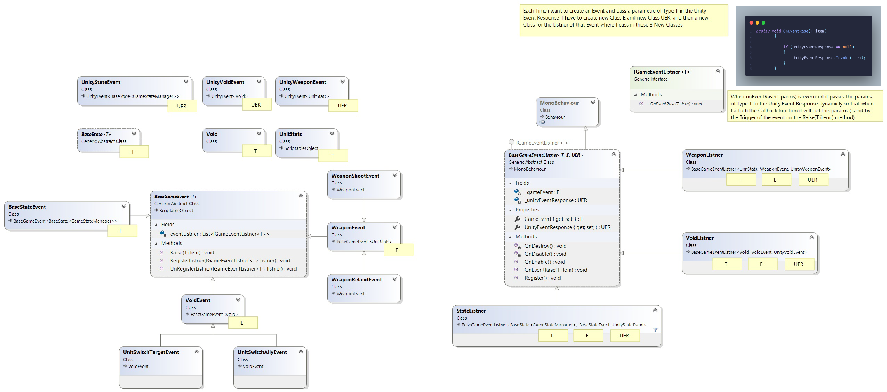

# how i build it

First Step

-> toImplement (After Testing) => Class Tile Inherit from Node => When instantiate Tile We instantite Node
			(and save instance of Tile in the Node ==> this is to verify if realy needed )
-> Grid take GameObject that detect its width and height + an attribute of the size of the node
-> node Neighbor will be 6 after testing its working with 4 ( and the cost of diagonal move is more tha the sides move)
-> using OnDrawGismos To debug the grid with colors

---- Create Grid Of Nodes ----------------------------
1) create plane with some gridWidth and gridHeight value 
2) do what ever we want to create into this rectangle -> building the obsacle of the map
	widthout taking into consideration any coordonate
3) create grid of Node with the same width and height of the Plane Object
	- this Grid of Node is the Stucture of a graph DataType
	- each node have:
		- some coordonate(x,y)
		- an array of nodes as neighbors
		- a methode to detect if some GameObject is above it ( if it has some thing it will save it and update the node to isObstacle)
		- and other properties like isObstacle ...
4) to create this grid of Node we are creating new Class named GridPath the instance of this class is not destroyed between scenes
	using the Singlton patern. and it has a methode to Search the Shortest path between 2 nodes in the grid based on the A* Algorithm
5) after implementing this, we have a grid of nodes each Node detect if some thing is above it (isObstacle) or not,
	and by setting a start Node and destination Node we can search for the sortest path betwenn them.

----------------- Player Movement ------------------------------------ 
1) player is moving in 4 direction (Left, Right, Up, Down) from tile to tile
	- he is always standing in the midle of the tile
	- the next Node(Tile) coordinate he will pass to is know but not the direction => need to detect the direction
	- to make it folow certain direction we instantiate some empty GameObject for each node in the center of its coord
	- each time the player reach that gameObject a new direction (from the next node) is set .. until it reach the final destination
	

Second Step

----------------  player Movement range -------------------

toDo: the queue hold the List<Node> path and Vect3[] turnPoint, each time we execute the  we update the grid with the path and turnPoints
the constructor of the Action do all the calculation and save the start and destination point too.

1) if the player have 8 as rangeMovment it can move for exemple until 8 tiles to the left not more ( it wont move )
2) if he moves for 4 tile or less he can remove again 4 tiles.
3) each move cost 1 action point

4) later we will have some obstacle that the player cant click on but he will jump over them
5) the player controles  multiple charachters and can only select 1 charachter at a time 
6) the charracter can trigger multiple action (even if the action take time ), then excecute them one by one

--------------------------------- player Class -----------------
4) the player have some action that he can do: each action have a cost (1 or 2) if the action point of the player reach 0 his turn ends

------------ Worker Queue implementation   -------------

1) player does not have to wait until he finish the action to do some other action,
	while he is moving he can click on any tile to move again after finishing the first move
	and he can do other action too like shooting, realoding ....
2) i have created an abstaract class of name ActionType that have <string>name, <Action>callback properties
	and an abstract methode <Void>TryExecuteAction that calls the callback methode
	each action inhirit from that class and each action have their own callback funtion logit and params
	if the callback he params i use the keyword new to override the ActionType abstract property
3) each action created is an instance of TypeAction, so i have created a <ActionType>queque, and every time the player request
	some action i dequeue the first action and tryExecute it when it finish executing (it could be IEnumeration callback )
	i check if there is more action in the queue and retry the process.

----------- Flanking Enemy ----------

1) Any Node can have 4 sides of <Stract>Cover, Left, Right, Up, Down, it depend on if the neighbor side is Obstacle or not
	at the same time it has 4 sides of flank bool variable, if it has cover of the left side it is flanked on the right side and so on
2) the player can switch between Enemies and have a selectOne, based on the player position toward the selected Enemy, we change the 
	Enemy property isFlanked and to some logic

------ Player Shooting ------------
1) inside the Player GameObject i have placed a Camera wich contains an Object Weapon, the role of the camera is to have a Ray that
	point to the center of that Camera Screen so that the weapon have the direction always pointed to the center of the Camera
2) the Script Weapon contain multiple properties so that we can easly change the behavior of the Weapon as needed (pistol, shotgun, ak47, ..)
	and the shooting is cosider an action that can be enqueued.

# State Machine Pattern

# Observable Pattern

# Command Pattern

