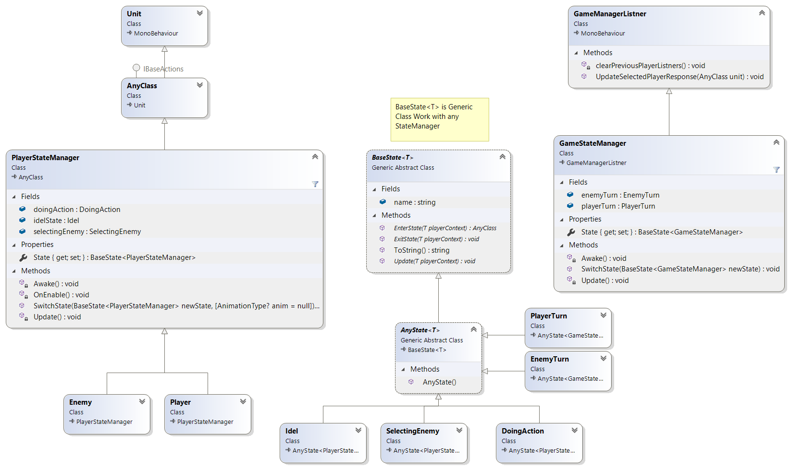
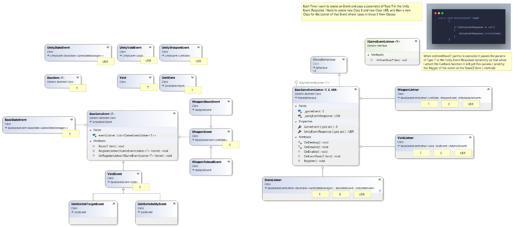
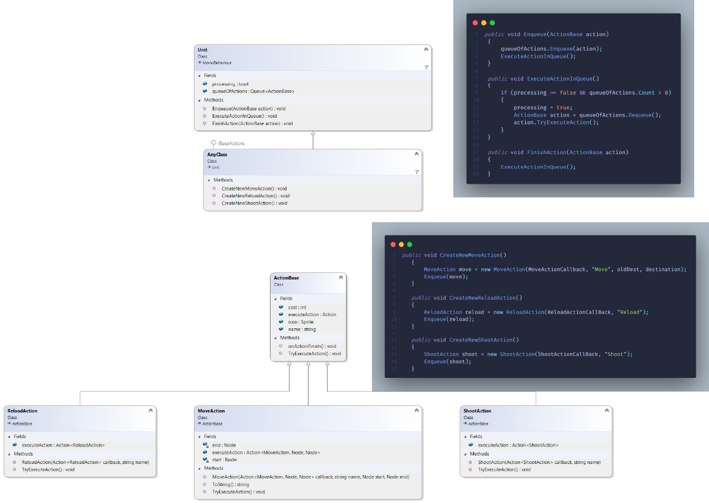

# XCOME CLONE

My first Game with Unity
## Table of contents

- [General info](#general-info)
- [Technologies](#technologies)
- [Setup](#setup)
- [Show Case](#show-case)

## General info
In this 3D project I have tried to clone the XCOM game behaviour and explore the unity engine feacher, and Create my own Tile system.

## Technologies
- Unity 2021

## Feachers
In this project I have worked with:
 - Patterns
    - Command Pattern
    - Observable Pattern
    - State Mchine

- Animation
- Scriptable Object
- Generic Classes
- Kenematic Equations

## Setup on Windows

## Play The Game
download here
## clone repo
    git clone 
    
Unity Version 2021

assets:

* Brakeys [western-props-pack](https://devassets.com/downloads/assets/western-props-pack.zip)

* Custom [Charachters](https://drive.google.com/file/d/11IcDb77b2lOJkcncJNpJmaBOXXDW9Zdx/view?usp=sharing)

* Free [Unity Particle Pack 5.x](https://assetstore.unity.com/packages/essentials/asset-packs/unity-particle-pack-5-x-73777)

    * you may need to update The PostProcessing package 

# Show Case

# State Machine Pattern

# Observable Pattern

# Command Pattern

   

